# Wireframes + Flujos + Diagramas (super detallado)

Este documento baja a detalle la UX y los flujos operativos. Los diagramas están en **Mermaid** (pegables en GitHub/Notion/VS Code con extensión Mermaid).

## 0) Convenciones

- **Objetivo UI**: “rápido para operar” (ventas/inventario) + “rápido para ver” (métricas).
- **Patrón**: App desktop con layout tipo web.
- **Rol en MVP**: solo **Admin** (con permisos completos), pero el diseño de pantallas/acciones queda listo para roles futuros.
- **Arquitectura**: backend por **microservicios** (local), detrás de un API Gateway.
- **Layout base**:
  - Sidebar izquierda (módulos)
  - Header superior (búsqueda global + usuario)
  - Área central (tabla + panel detalle)

## 1) Mapa de navegación (Sitemap)

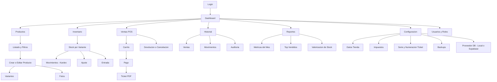

## 2) Wireframes (ASCII)

### 2.1 Layout global (todas las pantallas internas)

```
+----------------------------------------------------------------------------------+
| Header: [Search: SKU / nombre / variante...]  [Atajos]     [Usuario ▾] [Logout]  |
+----------------------+-----------------------------------------------------------+
| Sidebar              | Breadcrumb / Title                                         |
| - Dashboard          |-----------------------------------------------------------|
| - Ventas (POS)       |  Area principal: tablas / formularios / reportes           |
| - Productos          |                                                           |
| - Inventario         |                                                           |
| - Historial          |                                                           |
| - Reportes           |                                                           |
| - Configuración      |                                                           |
| - Usuarios           |                                                           |
+----------------------+-----------------------------------------------------------+
| Footer opcional: estado DB, sync, backups, versión                                |
+----------------------------------------------------------------------------------+
```

### 2.2 Login

```
+----------------------------------------+
|  Logo / Nombre tienda                   |
|----------------------------------------|
|  Usuario:  [______________]            |
|  Clave:    [______________]            |
|  ( ) Recordar usuario                   |
|----------------------------------------|
|  [ Ingresar ]                           |
|----------------------------------------|
|  Estado DB: Local SQLite ✓              |
+----------------------------------------+
```

### 2.3 Dashboard (métricas rápidas)

```
+------------------------------ DASHBOARD -----------------------------------------+
|  KPIs (mes actual)                                                               |
|  [Ventas $]   [Tickets #]   [Unidades #]   [Margen $]   [Stock bajo #]           |
|----------------------------------------------------------------------------------|
|  Gráfico simple: Ventas por día (mes)                Top 10 vendidos (unidades)  |
|  +------------------------------+              +--------------------------------+ |
|  |                              |              | 1) ...                        | |
|  |   (línea o barras)           |              | 2) ...                        | |
|  |                              |              | ...                           | |
|  +------------------------------+              +--------------------------------+ |
|----------------------------------------------------------------------------------|
|  Alertas                                                                         |
|  - Stock bajo: [Ver]   - Stock agotado: [Ver]   - Movimientos hoy: [Ver]         |
+----------------------------------------------------------------------------------+
```

### 2.4 Productos — listado + filtros

```
+--------------------------------- PRODUCTOS -------------------------------------+
| Filtros:                                                                        |
| [Buscar...] [Categoría ▾] [Marca ▾] [Proveedor ▾] [Talla ▾] [Color ▾]            |
| [Stock: >0 ▾] [Precio: min__ max__] [Fecha creación: __ a __]   [Limpiar] [Aplicar]
|----------------------------------------------------------------------------------|
| Tabla: SKU | Nombre | Categoría | Marca | Variantes | Stock total | Precio | ... |
|----------------------------------------------------------------------------------|
| [ ] 10001 | Camisa Oxford | Camisas | X | 6 | 24 | 39.99 | [Editar] [Ver]         |
| [ ] 10002 | ...                                                                   
|----------------------------------------------------------------------------------|
| Acciones: [Nuevo producto] [Importar CSV] [Exportar]                              |
+----------------------------------------------------------------------------------+
```

### 2.5 Producto — detalle / edición (con pestañas)

```
+---------------------------- PRODUCTO: Camisa Oxford -----------------------------+
| Tabs: [General] [Variantes] [Fotos] [Historial]                                   |
|----------------------------------------------------------------------------------|
| General                                                                          |
| SKU: [10001]   Nombre: [_____________]  Categoría: [▾] Marca: [▾]                |
| Proveedor: [▾]  Costo: [__]  Precio: [__]  Impuesto: [▾]                         |
| Descripción:                                                                     |
| [.............................................................................] |
| Estado: (•) Activo  ( ) Inactivo                                                  |
|----------------------------------------------------------------------------------|
| [Guardar] [Guardar y nuevo] [Cancelar]                                           |
+----------------------------------------------------------------------------------+
```

### 2.6 Variantes (talla/color) + stock

```
+--------------------------------- VARIANTES -------------------------------------+
| Acciones: [Agregar variante] [Generar por tallas] [Generar por colores]          |
|----------------------------------------------------------------------------------|
| Tabla: Talla | Color | SKU variante | Código barras | Stock | Precio | Estado    |
|----------------------------------------------------------------------------------|
| M     | Azul  | 10001-M-AZ | ... | 5  | 39.99 | Activo   [Editar] [Kardex]        |
| L     | Azul  | ...        | ... | 2  | 39.99 | Activo   [Editar] [Kardex]        |
|----------------------------------------------------------------------------------|
| Panel derecha (opcional): resumen stock total / alertas                           |
+----------------------------------------------------------------------------------+
```

### 2.7 Inventario — stock por variante + acciones rápidas

```
+-------------------------------- INVENTARIO -------------------------------------+
| Buscador rápido: [SKU/Nombre]  [Categoría ▾] [Marca ▾] [Stock bajo ▾]            |
|----------------------------------------------------------------------------------|
| Tabla: SKU Var | Producto | Talla | Color | Stock | Mínimo | Últ. movimiento | ...|
|----------------------------------------------------------------------------------|
| ...                                                                              |
|----------------------------------------------------------------------------------|
| Acciones: [Entrada] [Ajuste] [Ver Kardex]                                        |
+----------------------------------------------------------------------------------+
```

### 2.8 POS — venta rápida

```
+---------------------------------- VENTAS (POS) ---------------------------------+
| Input rapido: [Scan SKU / buscar...]   Cliente opcional: [Nombre] [Telefono]    |
|----------------------------------------------------------------------------------|
| Carrito:                                                                          |
| SKU Var | Producto | Talla | Color | Cant | Precio | Desc | Subtotal | [Quitar]   |
|----------------------------------------------------------------------------------|
| 10001-M-AZ | Camisa Oxford | M | Azul | [1▾] | 39.99 | 0 | 39.99                 |
|----------------------------------------------------------------------------------|
| Resumen:  Subtotal: $___   Impuesto: $___   Descuento: $___   TOTAL: $___        |
|----------------------------------------------------------------------------------|
| Pago: (•) Efectivo  ( ) Tarjeta  ( ) Transferencia   Monto recibido: [__]        |
| Cambio: $___                                                                    |
| [Cobrar y generar PDF]   [Cobrar sin imprimir]   [Cancelar venta]                |
+----------------------------------------------------------------------------------+
```

**Notas UX (barcode)**

- Si el lector USB actúa como teclado, el campo “Input rápido” debe estar siempre enfocado.
- Soportar sufijos típicos del lector: Enter/Tab al final del scan.
- Mostrar “pill” de confirmación: `Leído: 10001-M-AZ`.

### 2.9 Historial — ventas/movimientos/auditoría

```
+---------------------------------- HISTORIAL ------------------------------------+
| Tabs: [Ventas] [Movimientos] [Auditoría]                                          |
|----------------------------------------------------------------------------------|
| Filtros: [Fecha __ a __] [Usuario ▾] [Tipo ▾] [Buscar SKU/ID] [Aplicar]          |
|----------------------------------------------------------------------------------|
| Tabla (Ventas): ID | Fecha | Usuario | Total | Método pago | Estado | [Ver] [PDF] |
|----------------------------------------------------------------------------------|
| Detalle (drawer): items, motivo cancelación/devolución, movimientos generados    |
+----------------------------------------------------------------------------------+
```

### 2.10 Configuración — DB Provider y migración

```
+------------------------------ CONFIGURACIÓN: Base de datos ----------------------+
| Proveedor activo:  (•) Local SQLite   ( ) Postgres Local   ( ) Supabase           |
|----------------------------------------------------------------------------------|
| Modo operacion: (•) Local-only   ( ) Hybrid local-first + sync   ( ) Cloud-only   |
| Sync nube: (•) Activado  ( ) Desactivado   Pendientes: [__]   [Sincronizar ahora] |
|----------------------------------------------------------------------------------|
| Ticket PDF: Plantilla: (•) Informal  ( ) Fiscal (opcional)                        |
| Cliente: Campos: [Nombre ✓] [Telefono ✓] [Email _] [Documento _] [Notas _]        |
|----------------------------------------------------------------------------------|
| Local SQLite:                                                                    |
| Ruta data: C:\...\data\inventario.db   [Cambiar ruta]                             |
| Backups automáticos: (•) Sí  ( ) No   Frecuencia: [Diaria ▾] Retención: [30]     |
| [Crear backup ahora]  [Restaurar backup]                                         |
|----------------------------------------------------------------------------------|
| Supabase:                                                                        |
| URL: [______________]  API Key: [______________]                                  |
| Storage bucket: [inventario-images]                                              |
| [Probar conexión]  [Migrar ahora]  [Volver a Local]                              |
|----------------------------------------------------------------------------------|
| Nota: "Migrar ahora" exporta local, crea esquema, sube datos e imagenes.         |
+----------------------------------------------------------------------------------+
```

**Microservicios**

- En modo microservicios, esta configuración aplica a:
  - DB del servicio Catálogo
  - DB del servicio Inventario
  - DB del servicio Ventas
  - DB del servicio Reportes (si materializa agregados)
- En MVP local se puede desplegar un **Postgres único** con **bases separadas por servicio** (recomendado) o esquemas separados.

## 3) Flujos (User Flows) — ultra detallados

### 3.1 Flujo: alta de producto con variantes y fotos

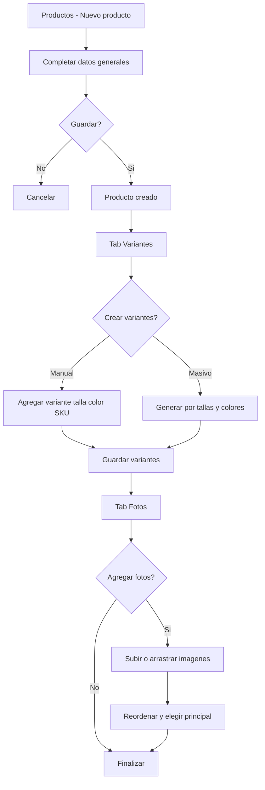

**Reglas**

- SKU producto: único.
- SKU variante: único (puede ser generado: `SKU-PROD-TALLA-COLOR`).
- Fotos opcionales: se permite 0.

### 3.2 Flujo: entrada de inventario (recepción)

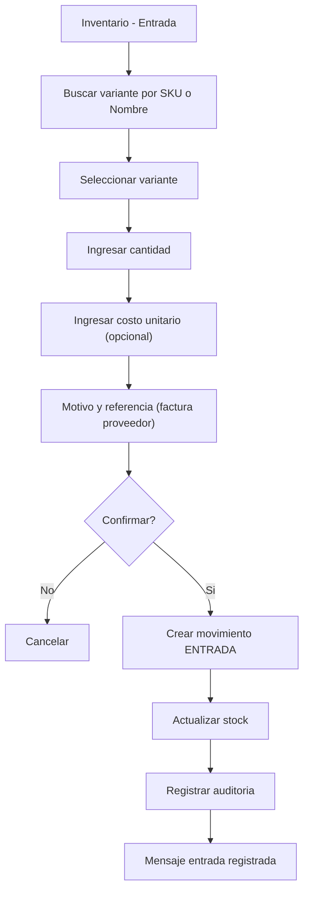

**Validaciones**

- Cantidad > 0.
- Si costo se usa para margen: costo >= 0.

### 3.3 Flujo: venta en POS + ticket PDF

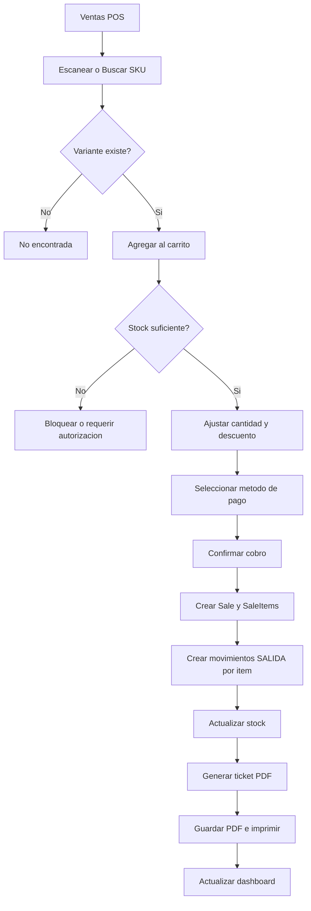

**Reglas críticas (consistencia)**

- La venta y la salida de inventario van en **una transacción**.
- Si falla el PDF, la venta igualmente puede quedar registrada; el PDF se reintenta desde Historial.

### 3.4 Flujo: devolución / cancelación

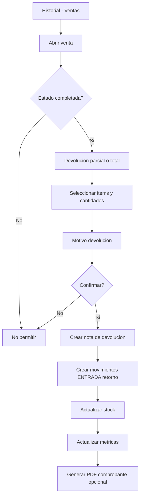

### 3.5 Flujo: ajuste de inventario (conteo/merma/corrección)

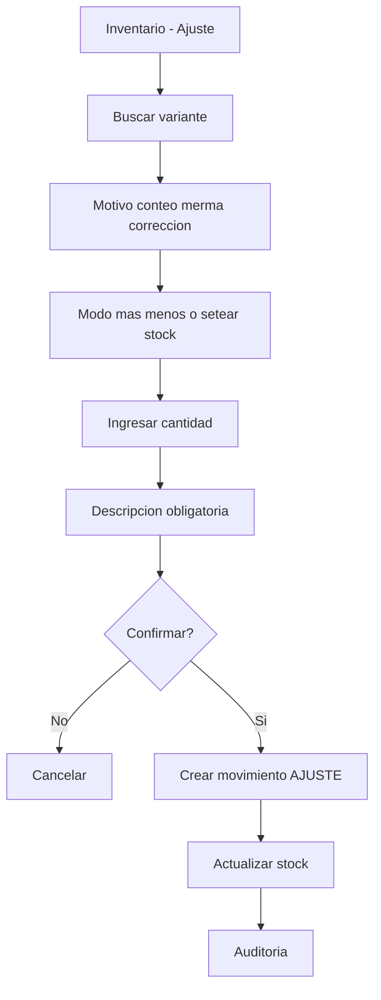

**Política**

- Ajustes requieren permiso especial.
- Para “setear stock” se registra como ajuste con delta calculado.

### 3.6 Flujo: escaneo por lector USB (modo teclado)

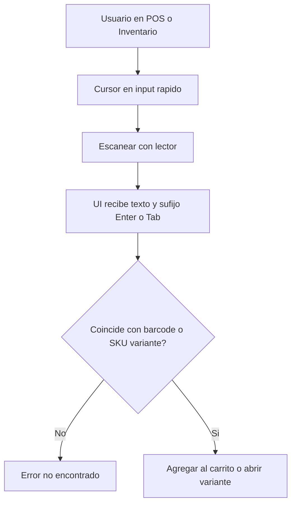

### 3.7 Flujo: escaneo con celular (cámara) — 2 modos posibles

**Modo A (recomendado, simple):** la app usa la **cámara del propio PC** (webcam) en una pantalla de “Escanear”.

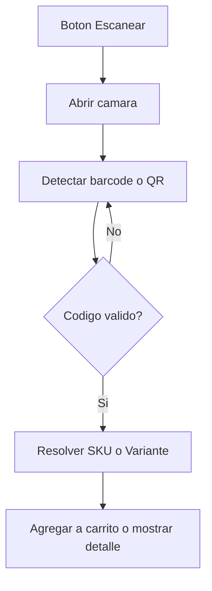

**Modo B (celular como scanner):** el celular escanea y envía el texto al PC por red local.

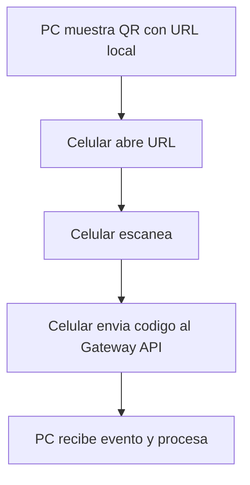

### 3.8 Flujo: generar códigos en la app (listos para imprimir)

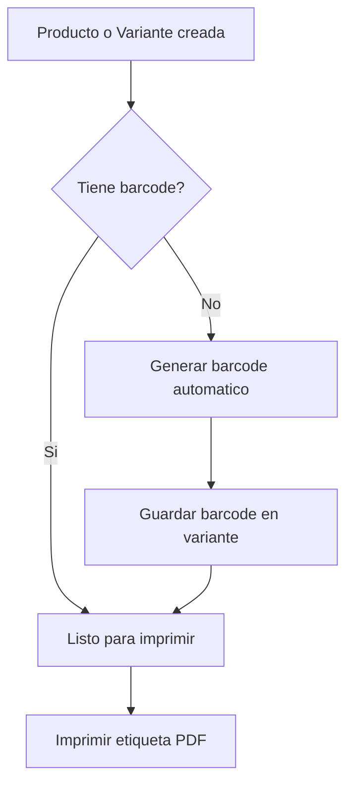

## 4) Diagramas de dominio (ERD / Datos)

### 4.1 ERD (alto nivel)

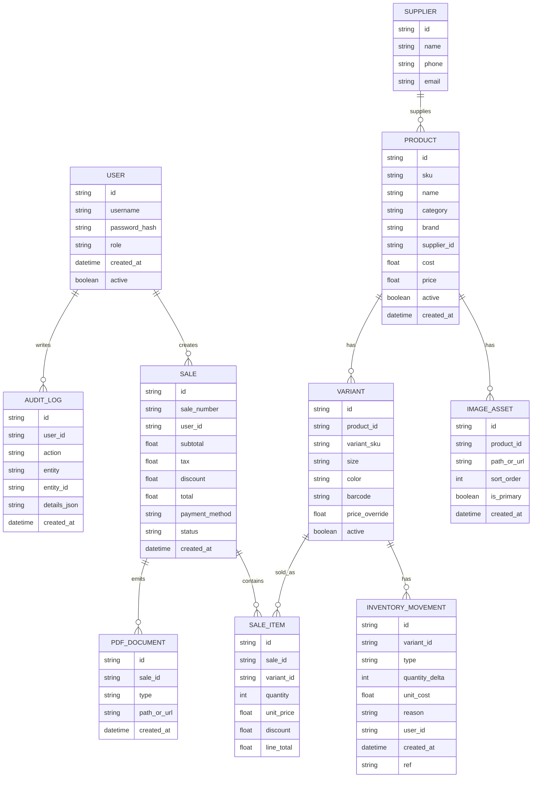

## 5) Diagramas de secuencia (casos críticos)

### 5.1 Secuencia: Cobrar venta

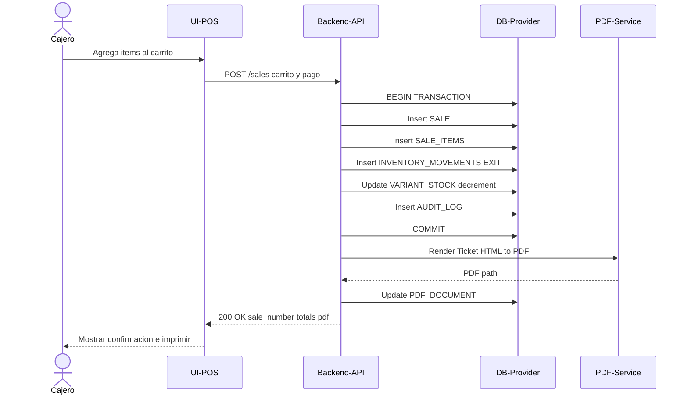

**Manejo de error**

- Si falla PDF después de commit: la venta queda OK, UI muestra “PDF pendiente” y se permite “Regenerar PDF” desde Historial.

### 5.2 Secuencia: Ajuste de inventario

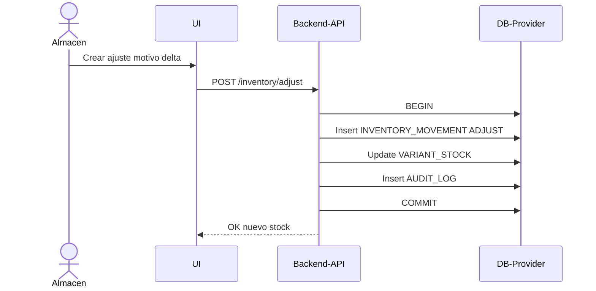

## 6) Estado y reglas de negocio

### 6.1 Estados de venta

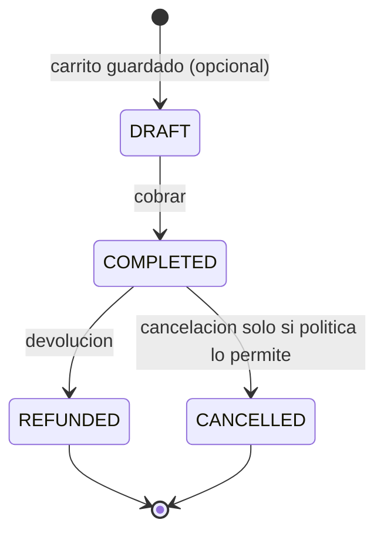

**Políticas recomendadas**

- Cancelación: solo si es el mismo día y por rol Admin, o si no se imprimió ticket (a definir).
- Reembolso: crea movimientos de ENTRADA y log.

### 6.2 Reglas de stock

- Stock no debe quedar negativo salvo:
  - Permiso especial (ventas sobrepedido) o modo “reservas”.
- En MVP: bloquear negativo por defecto.

## 7) Filtros avanzados — diseño (sin inventar UI extra)

### 7.1 Modo MVP (filtros comunes + combinables)

- Barra de filtros con combos y rangos.
- Botón Aplicar / Limpiar.

### 7.2 Modo Pro (builder lógico) — planeado

Si lo necesitas en fase 2:

- “Agregar condición” + “Grupo AND/OR”.
- Ejemplo condiciones:
  - `stock > 0`
  - `talla in [M,L]`
  - `color = 'Negro'`
  - `última_venta >= 2025-12-01`

## 8) Migración DB (Local → Supabase) — flujo UX + diagrama

### 8.1 Flujo UX (Configuración)

1) Usuario elige proveedor “Supabase”.
2) Ingresa URL + API Key + bucket.
3) “Probar conexión”.
4) “Migrar ahora”:
   - Export local (datos + imágenes)
   - Crear esquema/migraciones en Supabase
   - Subir datos
   - Subir imágenes a Storage
   - Verificar conteos (productos/variantes/ventas)
5) Cambiar proveedor activo.

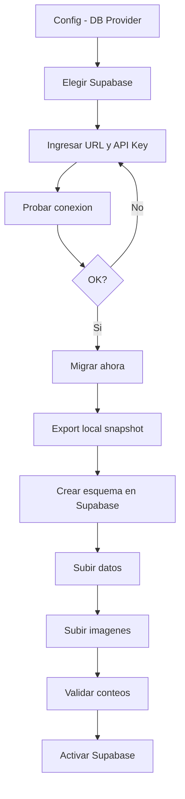

**Validación mínima**

- Conteo de Product/Variant igual.
- Stock total sumado igual.
- Ventas históricas igual.

## 9) Eventos “tiempo real” (local)

### 9.1 Eventos sugeridos

- `stock.updated` (variantId, newStock)
- `sale.created` (saleId, total)
- `movement.created` (movementId, type)

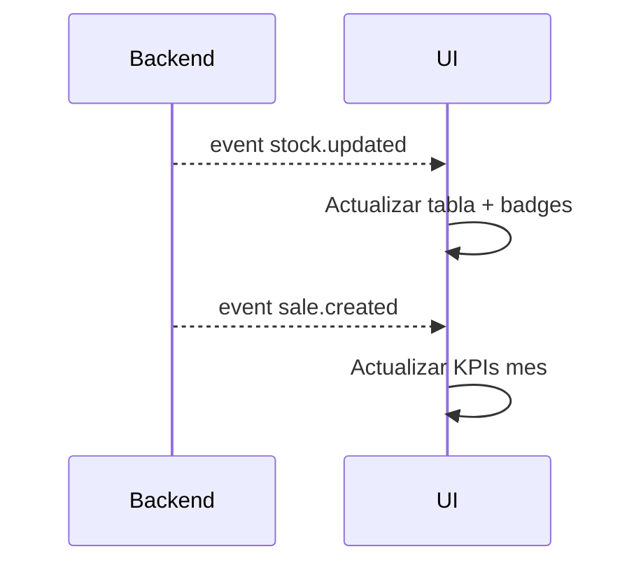

## 12) Arquitectura de microservicios (local)

### 12.1 Diagrama de componentes (alto nivel)

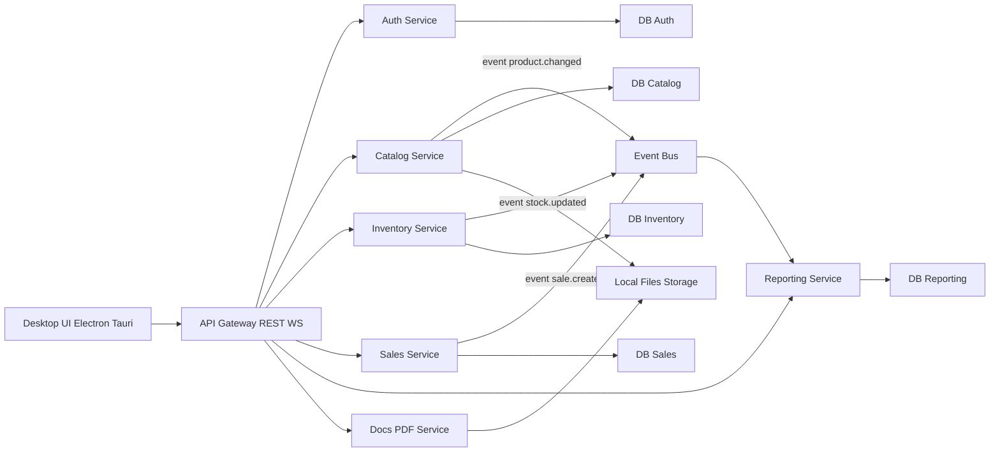

**Notas**

- El **Gateway** centraliza autenticación, rate limiting local, WebSocket y routing.
- Cada servicio es independiente y puede migrar su DB a Supabase (Postgres) cuando toque.
- Para simplificar local: un Postgres único con bases separadas (`catalog_db`, `inventory_db`, etc.).

### 12.2 Contratos (API) y eventos

Servicios y responsabilidades mínimas:

- **Catalog Service**: productos, variantes, fotos, generación de códigos.
- **Inventory Service**: stock materializado, movimientos, ajustes.
- **Sales Service**: ventas, devoluciones, tickets (coordinación con Docs).
- **Docs/PDF Service**: render HTML→PDF, plantillas ticket/etiquetas.
- **Reporting Service**: KPIs del mes, top vendidos (por eventos o consultas).

Eventos (mínimos):

- `catalog.variant.upserted`
- `inventory.movement.created`
- `inventory.stock.updated`
- `sales.sale.completed`
- `sales.sale.refunded`

### 12.3 Deployment local (Windows)

Opción recomendada para microservicios: **Docker Compose**.

- 1 contenedor por servicio + 1 Postgres + (opcional) NATS/Redis para bus.
- La UI desktop apunta al Gateway (`http://localhost:PORT`).

## 13) Barcode: formato, impresión y UX

### 13.1 Tipo de código recomendado

- **Code 128** para etiquetas de productos (muy compatible con lectores).
- **QR** opcional (útil para links o IDs largos, no necesario para caja).

### 13.2 Generación de códigos

Reglas sugeridas:

- Si el usuario ingresa barcode manual, se respeta si es único.
- Si no, el sistema genera uno:
  - `BARCODE = "INV" + año + secuencia` (ej: `INV2025000123`) o basado en `variant_sku`.

### 13.3 Impresión

Dos tipos:

- **Etiqueta** (para prenda): PDF con múltiples etiquetas por hoja o rollo.
- **Ticket** (venta): PDF térmico (80mm) o A4.

UX mínimo:

- En Variantes: botón `Imprimir etiquetas`.
- En Historial Venta: botón `Reimprimir ticket`.

## 10) Checklist de implementación de UX (para no perder nada)

- POS: atajo de teclado (Enter = agregar, F9 = cobrar) (opcional, si no rompe el MVP).
- Tablas: paginación + ordenación.
- Confirmaciones: ajustes/ventas/cancelaciones.
- Errores claros: “stock insuficiente”, “SKU no existe”.
- Historial con “Reimprimir PDF”.

## 11) Preguntas para terminar de afinar los wireframes (solo 3)

1) ¿Quieres POS con “cliente” opcional o no lo usarán?
2) ¿Ticket en tamaño 80mm (térmico) o A4?
3) ¿1 PC (local) o varias PCs en red local?
